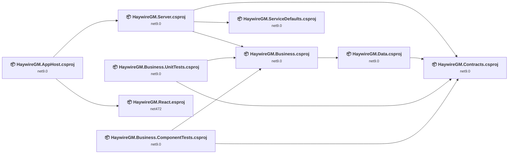
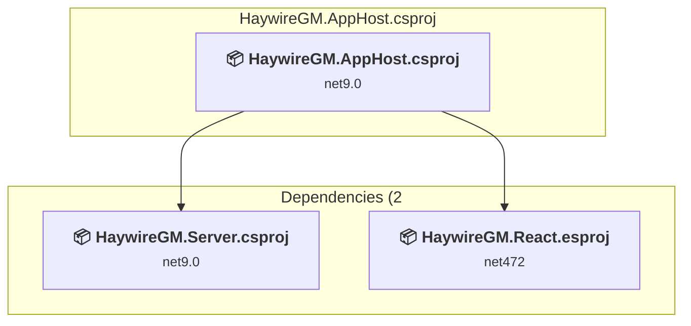
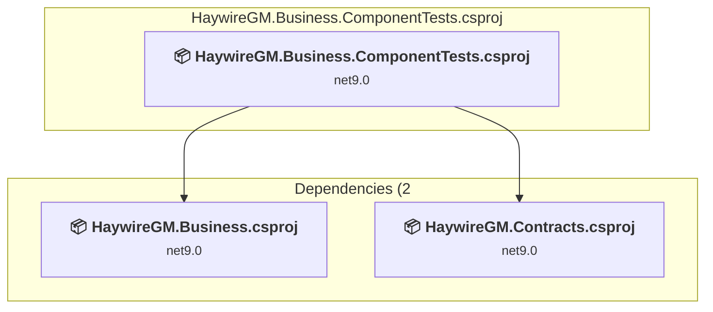
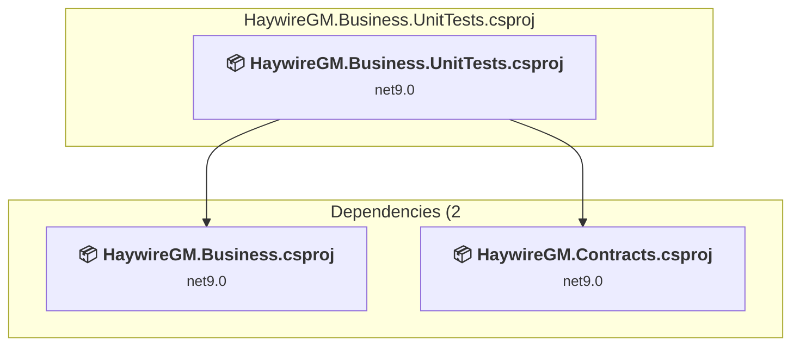
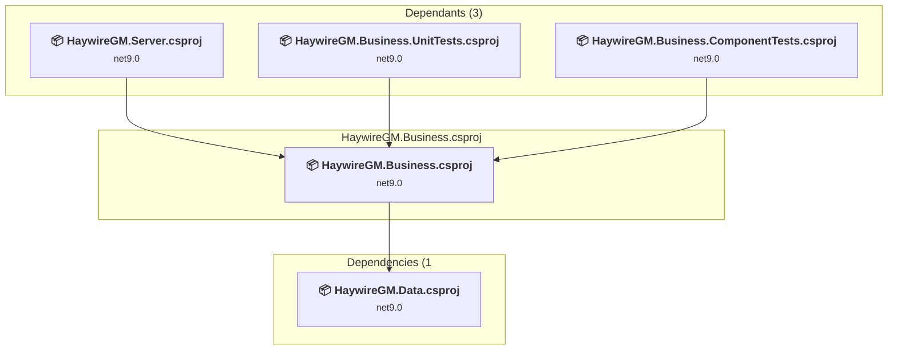
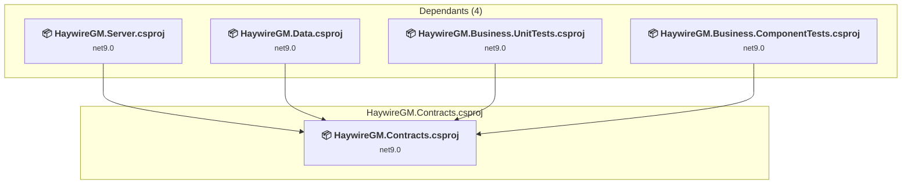
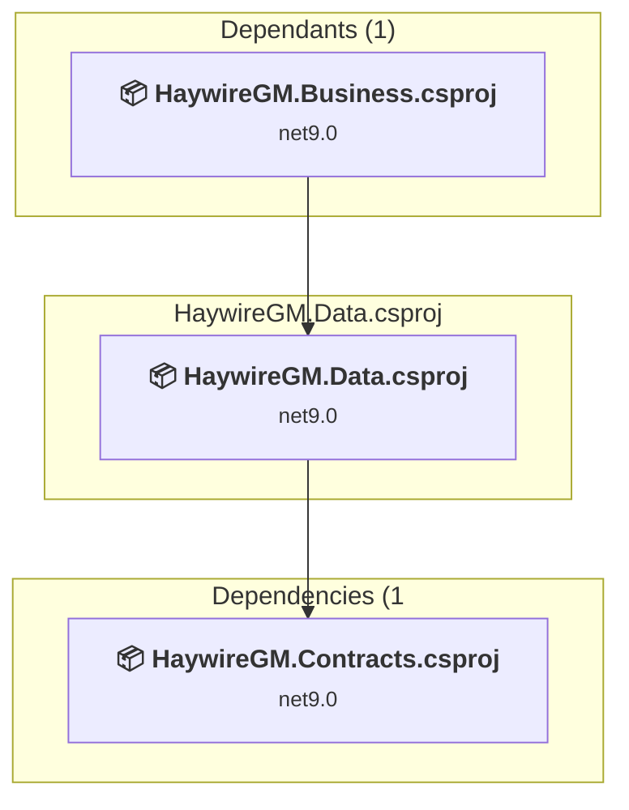
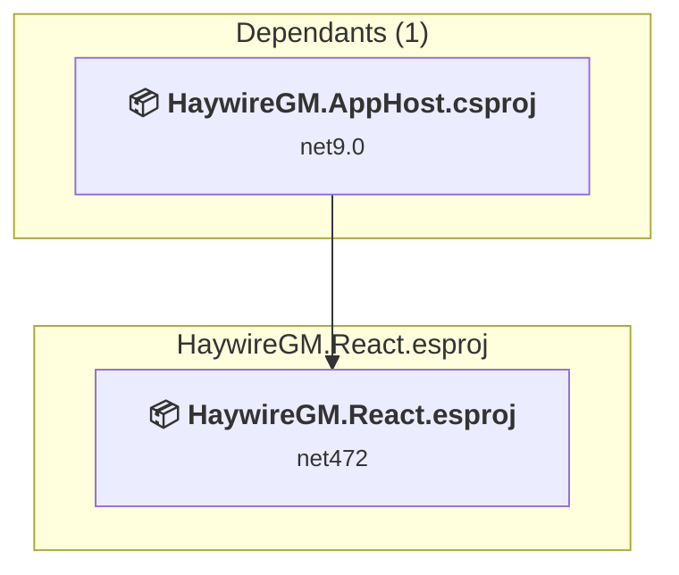
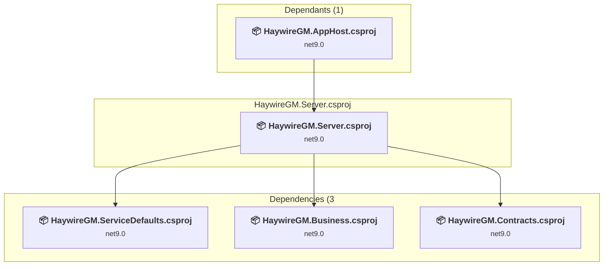
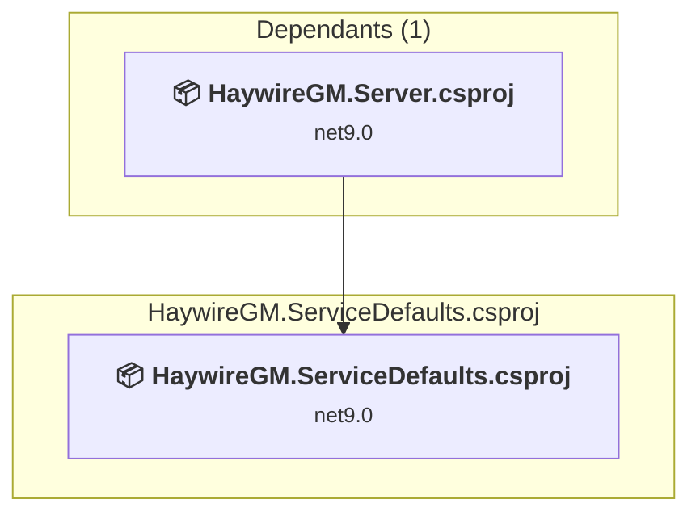

# Projects and dependencies analysis

This document provides a comprehensive overview of the projects and their dependencies in the context of upgrading to .NETCoreApp,Version=v10.0.

## Table of Contents

- [Executive Summary](#executive-Summary)
  - [Highlevel Metrics](#highlevel-metrics)
  - [Projects Compatibility](#projects-compatibility)
  - [Package Compatibility](#package-compatibility)
  - [API Compatibility](#api-compatibility)
- [Aggregate NuGet packages details](#aggregate-nuget-packages-details)
- [Top API Migration Challenges](#top-api-migration-challenges)
  - [Technologies and Features](#technologies-and-features)
  - [Most Frequent API Issues](#most-frequent-api-issues)
- [Projects Relationship Graph](#projects-relationship-graph)
- [Project Details](#project-details)

  - [HaywireGM.AppHost\HaywireGM.AppHost.csproj](#haywiregmapphosthaywiregmapphostcsproj)
  - [HaywireGM.Business.ComponentTests\HaywireGM.Business.ComponentTests.csproj](#haywiregmbusinesscomponenttestshaywiregmbusinesscomponenttestscsproj)
  - [HaywireGM.Business.UnitTests\HaywireGM.Business.UnitTests.csproj](#haywiregmbusinessunittestshaywiregmbusinessunittestscsproj)
  - [HaywireGM.Business\HaywireGM.Business.csproj](#haywiregmbusinesshaywiregmbusinesscsproj)
  - [HaywireGM.Contracts\HaywireGM.Contracts.csproj](#haywiregmcontractshaywiregmcontractscsproj)
  - [HaywireGM.Data\HaywireGM.Data.csproj](#haywiregmdatahaywiregmdatacsproj)
  - [HaywireGM.React\HaywireGM.React.esproj](#haywiregmreacthaywiregmreactesproj)
  - [HaywireGM.Server\HaywireGM.Server.csproj](#haywiregmserverhaywiregmservercsproj)
  - [HaywireGM.ServiceDefaults\HaywireGM.ServiceDefaults.csproj](#haywiregmservicedefaultshaywiregmservicedefaultscsproj)

## Executive Summary

### Highlevel Metrics

| Metric | Count | Status |
| :--- | :---: | :--- |
| Total Projects | 9 | All require upgrade |
| Total NuGet Packages | 34 | 15 need upgrade |
| Total Code Files | 79 |  |
| Total Code Files with Incidents | 12 |  |
| Total Lines of Code | 9346 |  |
| Total Number of Issues | 48 |  |
| Estimated LOC to modify | 23+ | at least 0.2% of codebase |

### Projects Compatibility

| Project | Target Framework | Difficulty | Package Issues | API Issues | Est. LOC Impact | Description |
| :--- | :---: | :---: | :---: | :---: | :---: | :--- |
| [HaywireGM.AppHost\HaywireGM.AppHost.csproj](#haywiregmapphosthaywiregmapphostcsproj) | net9.0 | 🟢 Low | 3 | 0 |  | DotNetCoreApp, Sdk Style = True |
| [HaywireGM.Business.ComponentTests\HaywireGM.Business.ComponentTests.csproj](#haywiregmbusinesscomponenttestshaywiregmbusinesscomponenttestscsproj) | net9.0 | 🟢 Low | 4 | 0 |  | DotNetCoreApp, Sdk Style = True |
| [HaywireGM.Business.UnitTests\HaywireGM.Business.UnitTests.csproj](#haywiregmbusinessunittestshaywiregmbusinessunittestscsproj) | net9.0 | 🟢 Low | 2 | 4 | 4+ | DotNetCoreApp, Sdk Style = True |
| [HaywireGM.Business\HaywireGM.Business.csproj](#haywiregmbusinesshaywiregmbusinesscsproj) | net9.0 | 🟢 Low | 0 | 1 | 1+ | ClassLibrary, Sdk Style = True |
| [HaywireGM.Contracts\HaywireGM.Contracts.csproj](#haywiregmcontractshaywiregmcontractscsproj) | net9.0 | 🟢 Low | 1 | 0 |  | ClassLibrary, Sdk Style = True |
| [HaywireGM.Data\HaywireGM.Data.csproj](#haywiregmdatahaywiregmdatacsproj) | net9.0 | 🟢 Low | 1 | 0 |  | ClassLibrary, Sdk Style = True |
| [HaywireGM.React\HaywireGM.React.esproj](#haywiregmreacthaywiregmreactesproj) | net472 | 🟢 Low | 0 | 0 |  | DotNetCoreApp, Sdk Style = True |
| [HaywireGM.Server\HaywireGM.Server.csproj](#haywiregmserverhaywiregmservercsproj) | net9.0 | 🟢 Low | 5 | 18 | 18+ | AspNetCore, Sdk Style = True |
| [HaywireGM.ServiceDefaults\HaywireGM.ServiceDefaults.csproj](#haywiregmservicedefaultshaywiregmservicedefaultscsproj) | net9.0 | 🟢 Low | 0 | 0 |  | ClassLibrary, Sdk Style = True |

### Package Compatibility

| Status | Count | Percentage |
| :--- | :---: | :---: |
| ✅ Compatible | 19 | 55.9% |
| ⚠️ Incompatible | 6 | 17.6% |
| 🔄 Upgrade Recommended | 9 | 26.5% |
| ***Total NuGet Packages*** | ***34*** | ***100%*** |

### API Compatibility

| Category | Count | Impact |
| :--- | :---: | :--- |
| 🔴 Binary Incompatible | 2 | High - Require code changes |
| 🟡 Source Incompatible | 16 | Medium - Needs re-compilation and potential conflicting API error fixing |
| 🔵 Behavioral change | 5 | Low - Behavioral changes that may require testing at runtime |
| ✅ Compatible | 9276 |  |
| ***Total APIs Analyzed*** | ***9299*** |  |

## Aggregate NuGet packages details

| Package | Current Version | Suggested Version | Projects | Description |
| :--- | :---: | :---: | :--- | :--- |
| Aspire.Hosting.NodeJS | 9.5.2 |  | [HaywireGM.AppHost.csproj](#haywiregmapphosthaywiregmapphostcsproj) | ⚠️NuGet package is deprecated |
| Aspire.Hosting.PostgreSQL | 9.1.0 | 13.3.5 | [HaywireGM.AppHost.csproj](#haywiregmapphosthaywiregmapphostcsproj) | NuGet package upgrade is recommended |
| BCrypt.Net-Next | 4.0.3 |  | [HaywireGM.Business.csproj](#haywiregmbusinesshaywiregmbusinesscsproj) | ✅Compatible |
| coverlet.collector | 6.0.4 |  | [HaywireGM.Business.ComponentTests.csproj](#haywiregmbusinesscomponenttestshaywiregmbusinesscomponenttestscsproj) [HaywireGM.Business.UnitTests.csproj](#haywiregmbusinessunittestshaywiregmbusinessunittestscsproj) | ✅Compatible |
| Dapper | 2.1.66 |  | [HaywireGM.Data.csproj](#haywiregmdatahaywiregmdatacsproj) [HaywireGM.Server.csproj](#haywiregmserverhaywiregmservercsproj) | ✅Compatible |
| Microsoft.AspNetCore.Authentication.JwtBearer | 9.0.3 | 10.0.8 | [HaywireGM.Server.csproj](#haywiregmserverhaywiregmservercsproj) | NuGet package upgrade is recommended |
| Microsoft.EntityFrameworkCore | 9.0.2 | 10.0.8 | [HaywireGM.Contracts.csproj](#haywiregmcontractshaywiregmcontractscsproj) | NuGet package upgrade is recommended |
| Microsoft.Extensions.ApiDescription.Client | 9.0.3 | 10.0.8 | [HaywireGM.Server.csproj](#haywiregmserverhaywiregmservercsproj) | NuGet package upgrade is recommended |
| Microsoft.Extensions.Configuration.Abstractions | 9.0.0 | 10.0.8 | [HaywireGM.Data.csproj](#haywiregmdatahaywiregmdatacsproj) | NuGet package upgrade is recommended |
| Microsoft.Extensions.Http.Resilience | 10.6.0 |  | [HaywireGM.ServiceDefaults.csproj](#haywiregmservicedefaultshaywiregmservicedefaultscsproj) | ✅Compatible |
| Microsoft.Extensions.Logging.Abstractions | 10.0.2 | 10.0.8 | [HaywireGM.Business.ComponentTests.csproj](#haywiregmbusinesscomponenttestshaywiregmbusinesscomponenttestscsproj) | NuGet package upgrade is recommended |
| Microsoft.Extensions.Logging.Abstractions | 9.0.10 | 10.0.8 | [HaywireGM.Business.UnitTests.csproj](#haywiregmbusinessunittestshaywiregmbusinessunittestscsproj) | NuGet package upgrade is recommended |
| Microsoft.Extensions.ServiceDiscovery | 10.6.0 |  | [HaywireGM.ServiceDefaults.csproj](#haywiregmservicedefaultshaywiregmservicedefaultscsproj) | ✅Compatible |
| Microsoft.NET.Test.Sdk | 17.12.0 |  | [HaywireGM.Business.ComponentTests.csproj](#haywiregmbusinesscomponenttestshaywiregmbusinesscomponenttestscsproj) | ✅Compatible |
| Microsoft.NET.Test.Sdk | 18.0.0 |  | [HaywireGM.Business.UnitTests.csproj](#haywiregmbusinessunittestshaywiregmbusinessunittestscsproj) | ✅Compatible |
| Microsoft.VisualStudio.Azure.Containers.Tools.Targets | 1.21.2 |  | [HaywireGM.Server.csproj](#haywiregmserverhaywiregmservercsproj) | ⚠️NuGet package is incompatible |
| Newtonsoft.Json | 13.0.3 | 13.0.4 | [HaywireGM.Server.csproj](#haywiregmserverhaywiregmservercsproj) | NuGet package upgrade is recommended |
| Npgsql | 9.0.2 |  | [HaywireGM.Data.csproj](#haywiregmdatahaywiregmdatacsproj) | ✅Compatible |
| Npgsql | 9.0.3 |  | [HaywireGM.Server.csproj](#haywiregmserverhaywiregmservercsproj) | ✅Compatible |
| NSwag.ApiDescription.Client | 14.2.0 |  | [HaywireGM.Server.csproj](#haywiregmserverhaywiregmservercsproj) | ✅Compatible |
| OpenTelemetry.Exporter.OpenTelemetryProtocol | 1.15.3 |  | [HaywireGM.ServiceDefaults.csproj](#haywiregmservicedefaultshaywiregmservicedefaultscsproj) | ✅Compatible |
| OpenTelemetry.Extensions.Hosting | 1.15.3 |  | [HaywireGM.ServiceDefaults.csproj](#haywiregmservicedefaultshaywiregmservicedefaultscsproj) | ✅Compatible |
| OpenTelemetry.Instrumentation.AspNetCore | 1.15.2 |  | [HaywireGM.ServiceDefaults.csproj](#haywiregmservicedefaultshaywiregmservicedefaultscsproj) | ✅Compatible |
| OpenTelemetry.Instrumentation.Http | 1.15.1 |  | [HaywireGM.ServiceDefaults.csproj](#haywiregmservicedefaultshaywiregmservicedefaultscsproj) | ✅Compatible |
| OpenTelemetry.Instrumentation.Process | 1.14.0-beta.2 |  | [HaywireGM.ServiceDefaults.csproj](#haywiregmservicedefaultshaywiregmservicedefaultscsproj) | ✅Compatible |
| OpenTelemetry.Instrumentation.Runtime | 1.15.1 |  | [HaywireGM.ServiceDefaults.csproj](#haywiregmservicedefaultshaywiregmservicedefaultscsproj) | ✅Compatible |
| SpecFlow.Tools.MsBuild.Generation | 3.9.74 |  | [HaywireGM.Business.ComponentTests.csproj](#haywiregmbusinesscomponenttestshaywiregmbusinesscomponenttestscsproj) | ⚠️NuGet package is deprecated |
| SpecFlow.xUnit | 3.9.74 |  | [HaywireGM.Business.ComponentTests.csproj](#haywiregmbusinesscomponenttestshaywiregmbusinesscomponenttestscsproj) | ⚠️NuGet package is deprecated |
| Swashbuckle.AspNetCore | 8.0.0 |  | [HaywireGM.Server.csproj](#haywiregmserverhaywiregmservercsproj) | ✅Compatible |
| System.Configuration.ConfigurationManager | 9.0.3 | 10.0.8 | [HaywireGM.Server.csproj](#haywiregmserverhaywiregmservercsproj) | NuGet package upgrade is recommended |
| xunit | 2.9.2 |  | [HaywireGM.Business.ComponentTests.csproj](#haywiregmbusinesscomponenttestshaywiregmbusinesscomponenttestscsproj) | ⚠️NuGet package is deprecated |
| xunit | 2.9.3 |  | [HaywireGM.Business.UnitTests.csproj](#haywiregmbusinessunittestshaywiregmbusinessunittestscsproj) | ⚠️NuGet package is deprecated |
| xunit.runner.visualstudio | 2.8.2 |  | [HaywireGM.Business.ComponentTests.csproj](#haywiregmbusinesscomponenttestshaywiregmbusinesscomponenttestscsproj) | ✅Compatible |
| xunit.runner.visualstudio | 3.1.5 |  | [HaywireGM.Business.UnitTests.csproj](#haywiregmbusinessunittestshaywiregmbusinessunittestscsproj) | ✅Compatible |

## Top API Migration Challenges

### Technologies and Features

| Technology | Issues | Percentage | Migration Path |
| :--- | :---: | :---: | :--- |

### Most Frequent API Issues

| API | Count | Percentage | Category |
| :--- | :---: | :---: | :--- |
| M:System.TimeSpan.FromMinutes(System.Int64) | 5 | 21.7% | Source Incompatible |
| T:System.Text.Json.JsonDocument | 4 | 17.4% | Behavioral Change |
| T:Microsoft.AspNetCore.Authentication.JwtBearer.JwtBearerDefaults | 2 | 8.7% | Source Incompatible |
| F:Microsoft.AspNetCore.Authentication.JwtBearer.JwtBearerDefaults.AuthenticationScheme | 2 | 8.7% | Source Incompatible |
| M:System.Threading.Tasks.Task.WhenAll(System.ReadOnlySpan{System.Threading.Tasks.Task}) | 1 | 4.3% | Source Incompatible |
| M:Microsoft.AspNetCore.Builder.ForwardedHeadersExtensions.UseForwardedHeaders(Microsoft.AspNetCore.Builder.IApplicationBuilder) | 1 | 4.3% | Behavioral Change |
| M:Microsoft.Extensions.DependencyInjection.OptionsConfigurationServiceCollectionExtensions.Configure''1(Microsoft.Extensions.DependencyInjection.IServiceCollection,Microsoft.Extensions.Configuration.IConfiguration) | 1 | 4.3% | Binary Incompatible |
| M:System.TimeSpan.FromSeconds(System.Int64) | 1 | 4.3% | Source Incompatible |
| P:Microsoft.AspNetCore.Authentication.JwtBearer.JwtBearerOptions.TokenValidationParameters | 1 | 4.3% | Source Incompatible |
| P:Microsoft.AspNetCore.Authentication.JwtBearer.JwtBearerOptions.Authority | 1 | 4.3% | Source Incompatible |
| T:Microsoft.Extensions.DependencyInjection.JwtBearerExtensions | 1 | 4.3% | Source Incompatible |
| M:Microsoft.Extensions.DependencyInjection.JwtBearerExtensions.AddJwtBearer(Microsoft.AspNetCore.Authentication.AuthenticationBuilder,System.Action{Microsoft.AspNetCore.Authentication.JwtBearer.JwtBearerOptions}) | 1 | 4.3% | Source Incompatible |
| M:Microsoft.Extensions.Configuration.ConfigurationBinder.Get''1(Microsoft.Extensions.Configuration.IConfiguration) | 1 | 4.3% | Binary Incompatible |
| P:Microsoft.AspNetCore.Builder.ForwardedHeadersOptions.KnownNetworks | 1 | 4.3% | Source Incompatible |

## Projects Relationship Graph

Legend:
📦 SDK-style project
⚙️ Classic project

## Project Details

### HaywireGM.AppHost\HaywireGM.AppHost.csproj

#### Project Info

- **Current Target Framework:** net9.0
- **Proposed Target Framework:** net10.0
- **SDK-style**: True
- **Project Kind:** DotNetCoreApp
- **Dependencies**: 2
- **Dependants**: 0
- **Number of Files**: 1
- **Number of Files with Incidents**: 1
- **Lines of Code**: 47
- **Estimated LOC to modify**: 0+ (at least 0.0% of the project)

#### Dependency Graph

Legend:
📦 SDK-style project
⚙️ Classic project

### API Compatibility

| Category | Count | Impact |
| :--- | :---: | :--- |
| 🔴 Binary Incompatible | 0 | High - Require code changes |
| 🟡 Source Incompatible | 0 | Medium - Needs re-compilation and potential conflicting API error fixing |
| 🔵 Behavioral change | 0 | Low - Behavioral changes that may require testing at runtime |
| ✅ Compatible | 177 |  |
| ***Total APIs Analyzed*** | ***177*** |  |

### HaywireGM.Business.ComponentTests\HaywireGM.Business.ComponentTests.csproj

#### Project Info

- **Current Target Framework:** net9.0
- **Proposed Target Framework:** net10.0
- **SDK-style**: True
- **Project Kind:** DotNetCoreApp
- **Dependencies**: 2
- **Dependants**: 0
- **Number of Files**: 5
- **Number of Files with Incidents**: 1
- **Lines of Code**: 529
- **Estimated LOC to modify**: 0+ (at least 0.0% of the project)

#### Dependency Graph

Legend:
📦 SDK-style project
⚙️ Classic project

### API Compatibility

| Category | Count | Impact |
| :--- | :---: | :--- |
| 🔴 Binary Incompatible | 0 | High - Require code changes |
| 🟡 Source Incompatible | 0 | Medium - Needs re-compilation and potential conflicting API error fixing |
| 🔵 Behavioral change | 0 | Low - Behavioral changes that may require testing at runtime |
| ✅ Compatible | 567 |  |
| ***Total APIs Analyzed*** | ***567*** |  |

### HaywireGM.Business.UnitTests\HaywireGM.Business.UnitTests.csproj

#### Project Info

- **Current Target Framework:** net9.0
- **Proposed Target Framework:** net10.0
- **SDK-style**: True
- **Project Kind:** DotNetCoreApp
- **Dependencies**: 2
- **Dependants**: 0
- **Number of Files**: 20
- **Number of Files with Incidents**: 2
- **Lines of Code**: 3893
- **Estimated LOC to modify**: 4+ (at least 0.1% of the project)

#### Dependency Graph

Legend:
📦 SDK-style project
⚙️ Classic project

### API Compatibility

| Category | Count | Impact |
| :--- | :---: | :--- |
| 🔴 Binary Incompatible | 0 | High - Require code changes |
| 🟡 Source Incompatible | 0 | Medium - Needs re-compilation and potential conflicting API error fixing |
| 🔵 Behavioral change | 4 | Low - Behavioral changes that may require testing at runtime |
| ✅ Compatible | 4067 |  |
| ***Total APIs Analyzed*** | ***4071*** |  |

### HaywireGM.Business\HaywireGM.Business.csproj

#### Project Info

- **Current Target Framework:** net9.0
- **Proposed Target Framework:** net10.0
- **SDK-style**: True
- **Project Kind:** ClassLibrary
- **Dependencies**: 1
- **Dependants**: 3
- **Number of Files**: 9
- **Number of Files with Incidents**: 2
- **Lines of Code**: 732
- **Estimated LOC to modify**: 1+ (at least 0.1% of the project)

#### Dependency Graph

Legend:
📦 SDK-style project
⚙️ Classic project

### API Compatibility

| Category | Count | Impact |
| :--- | :---: | :--- |
| 🔴 Binary Incompatible | 0 | High - Require code changes |
| 🟡 Source Incompatible | 1 | Medium - Needs re-compilation and potential conflicting API error fixing |
| 🔵 Behavioral change | 0 | Low - Behavioral changes that may require testing at runtime |
| ✅ Compatible | 907 |  |
| ***Total APIs Analyzed*** | ***908*** |  |

### HaywireGM.Contracts\HaywireGM.Contracts.csproj

#### Project Info

- **Current Target Framework:** net9.0
- **Proposed Target Framework:** net10.0
- **SDK-style**: True
- **Project Kind:** ClassLibrary
- **Dependencies**: 0
- **Dependants**: 4
- **Number of Files**: 29
- **Number of Files with Incidents**: 1
- **Lines of Code**: 923
- **Estimated LOC to modify**: 0+ (at least 0.0% of the project)

#### Dependency Graph

Legend:
📦 SDK-style project
⚙️ Classic project

### API Compatibility

| Category | Count | Impact |
| :--- | :---: | :--- |
| 🔴 Binary Incompatible | 0 | High - Require code changes |
| 🟡 Source Incompatible | 0 | Medium - Needs re-compilation and potential conflicting API error fixing |
| 🔵 Behavioral change | 0 | Low - Behavioral changes that may require testing at runtime |
| ✅ Compatible | 722 |  |
| ***Total APIs Analyzed*** | ***722*** |  |

### HaywireGM.Data\HaywireGM.Data.csproj

#### Project Info

- **Current Target Framework:** net9.0
- **Proposed Target Framework:** net10.0
- **SDK-style**: True
- **Project Kind:** ClassLibrary
- **Dependencies**: 1
- **Dependants**: 1
- **Number of Files**: 7
- **Number of Files with Incidents**: 1
- **Lines of Code**: 1117
- **Estimated LOC to modify**: 0+ (at least 0.0% of the project)

#### Dependency Graph

Legend:
📦 SDK-style project
⚙️ Classic project

### API Compatibility

| Category | Count | Impact |
| :--- | :---: | :--- |
| 🔴 Binary Incompatible | 0 | High - Require code changes |
| 🟡 Source Incompatible | 0 | Medium - Needs re-compilation and potential conflicting API error fixing |
| 🔵 Behavioral change | 0 | Low - Behavioral changes that may require testing at runtime |
| ✅ Compatible | 638 |  |
| ***Total APIs Analyzed*** | ***638*** |  |

### HaywireGM.React\HaywireGM.React.esproj

#### Project Info

- **Current Target Framework:** net472
- **Proposed Target Framework:** net10.0
- **SDK-style**: True
- **Project Kind:** DotNetCoreApp
- **Dependencies**: 0
- **Dependants**: 1
- **Number of Files**: 0
- **Number of Files with Incidents**: 1
- **Lines of Code**: 0
- **Estimated LOC to modify**: 0+ (at least 0.0% of the project)

#### Dependency Graph

Legend:
📦 SDK-style project
⚙️ Classic project

### API Compatibility

| Category | Count | Impact |
| :--- | :---: | :--- |
| 🔴 Binary Incompatible | 0 | High - Require code changes |
| 🟡 Source Incompatible | 0 | Medium - Needs re-compilation and potential conflicting API error fixing |
| 🔵 Behavioral change | 0 | Low - Behavioral changes that may require testing at runtime |
| ✅ Compatible | 0 |  |
| ***Total APIs Analyzed*** | ***0*** |  |

### HaywireGM.Server\HaywireGM.Server.csproj

#### Project Info

- **Current Target Framework:** net9.0
- **Proposed Target Framework:** net10.0
- **SDK-style**: True
- **Project Kind:** AspNetCore
- **Dependencies**: 3
- **Dependants**: 1
- **Number of Files**: 13
- **Number of Files with Incidents**: 2
- **Lines of Code**: 1976
- **Estimated LOC to modify**: 18+ (at least 0.9% of the project)

#### Dependency Graph

Legend:
📦 SDK-style project
⚙️ Classic project

### API Compatibility

| Category | Count | Impact |
| :--- | :---: | :--- |
| 🔴 Binary Incompatible | 2 | High - Require code changes |
| 🟡 Source Incompatible | 15 | Medium - Needs re-compilation and potential conflicting API error fixing |
| 🔵 Behavioral change | 1 | Low - Behavioral changes that may require testing at runtime |
| ✅ Compatible | 2071 |  |
| ***Total APIs Analyzed*** | ***2089*** |  |

### HaywireGM.ServiceDefaults\HaywireGM.ServiceDefaults.csproj

#### Project Info

- **Current Target Framework:** net9.0
- **Proposed Target Framework:** net10.0
- **SDK-style**: True
- **Project Kind:** ClassLibrary
- **Dependencies**: 0
- **Dependants**: 1
- **Number of Files**: 1
- **Number of Files with Incidents**: 1
- **Lines of Code**: 129
- **Estimated LOC to modify**: 0+ (at least 0.0% of the project)

#### Dependency Graph

Legend:
📦 SDK-style project
⚙️ Classic project

### API Compatibility

| Category | Count | Impact |
| :--- | :---: | :--- |
| 🔴 Binary Incompatible | 0 | High - Require code changes |
| 🟡 Source Incompatible | 0 | Medium - Needs re-compilation and potential conflicting API error fixing |
| 🔵 Behavioral change | 0 | Low - Behavioral changes that may require testing at runtime |
| ✅ Compatible | 127 |  |
| ***Total APIs Analyzed*** | ***127*** |  |

